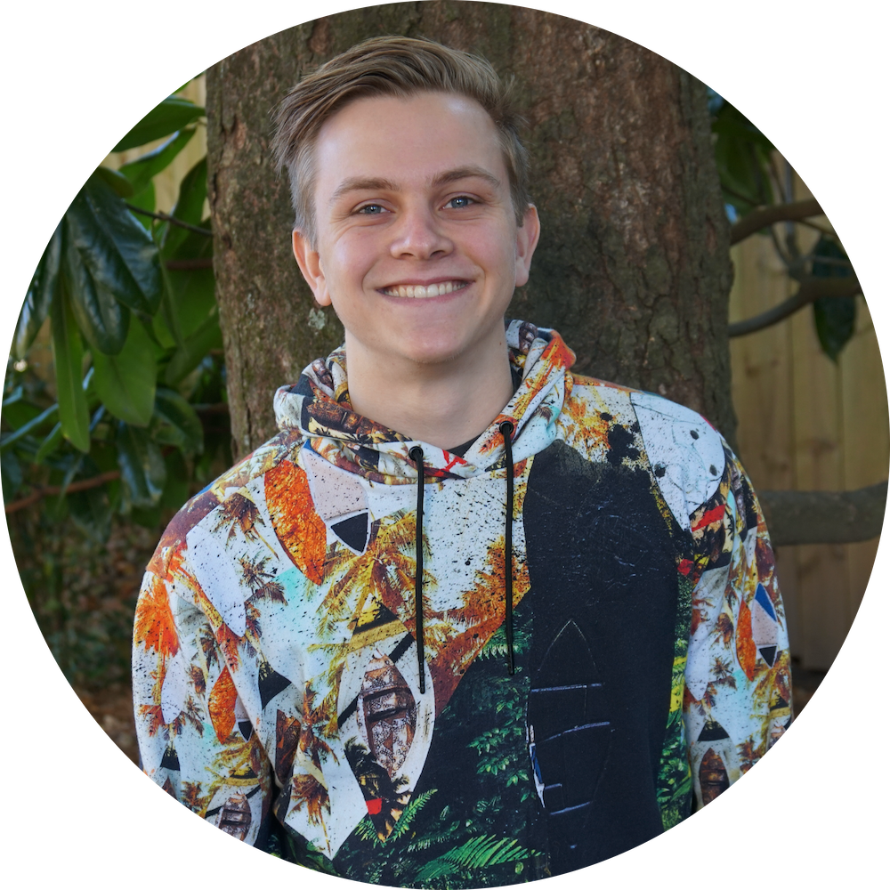

	

		
	

# Who am I?
{: style="text-align: center"}

Hello! My name is Cole McCorkle and I'm a full-time software engineer and graduate student.

I have over nine years of experience programming. From steam trading bots in 2015 to developer tooling and APIs in 2025, my work has been quite varied.

I attended Elon University where I got my bachelors degree in Computer Science with minors in Data Science and Sociology. I am currently pursuing a Master's degree in Computer Engineering

Please feel free to take a look around!

